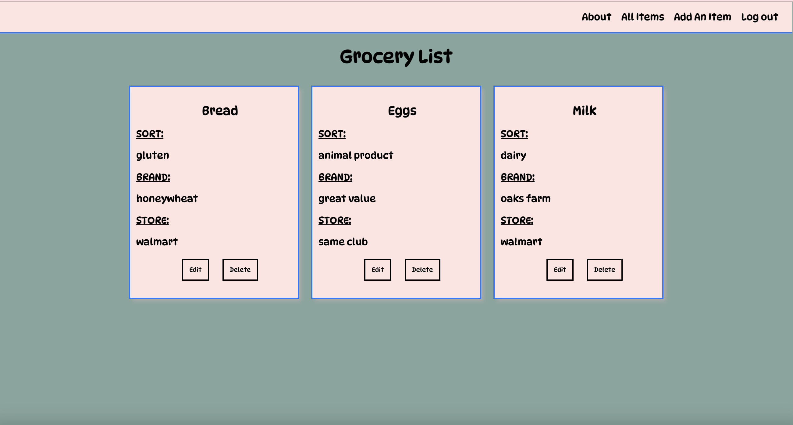

# The Grocery List

[The Grocery List](https://thegrocerystore.herokuapp.com/) was brought to you by someone who buys the same products over and over again, but still needs to write down a list every time - or they will forget. Explore my final project at General Assembly, brought you by Django and Python.

[Trello](https://trello.com/b/XuSg4GCD/the-grocery-list#)

# Technologies Used

# Future Enhancements
<ul>
<li>AAU, I would like to be able to have a completion/checkmark option</li>
<li>AAU, I would like to add a stock/sum price option</li>
</ul>

